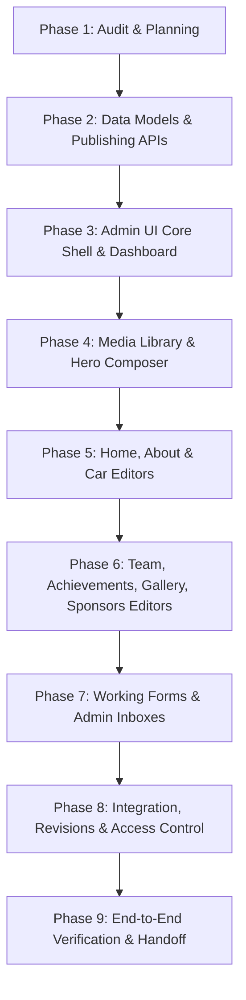

# Admin CMS Implementation Plan & Specification — E-Formula Ashwa Riders

This plan defines the technical specification, user interface design, data architecture, publishing workflow, and migration strategy for building the **Ashwa Riders Admin CMS Panel** at `/admin`.

---

## 1. Interface & Design System Specification

The admin interface design is inspired by modern dark-mode administrative panels with fine border accents, compact resource management tables, and slide-in drawer editors.

```
┌─────────────────────────────────────────────────────────────────────────────────────────────┐
│  Ashwa Riders CMS Header / Breadcrumbs                               [Admin: Isha] [Logout]  │
├──────────────┬────────────────────────────────────────────────────────┬─────────────────────┤
│              │ Dashboard / Resource Table                             │ Editor Drawer       │
│ SIDEBAR      │ Search: [_____________] Filter: [All] (+ Add New)      │ (Slide-in Right)    │
│ ──────────── │ ┌────┬──────────────┬──────────┬──────────┬──────────┐ │ ┌─────────────────┐ │
│ OVERVIEW     │ │ #  │ Title        │ Status   │ Updated  │ Actions  │ │ │ Slide 01: Hero  │ │
│ - Dashboard  │ ├────┼──────────────┼──────────┼──────────┼──────────┤ │ │ 📝 Text Group   │ │
│ - Messages   │ │ 01 │ Tarkshya EV  │ Published│ 2h ago   │ Edit/Dup │ │ │ 🖼 Media Group  │ │
│ - Join Apps  │ │ 02 │ Formula B.   │ Draft    │ 1d ago   │ Edit/Dup │ │ │ 🎨 Overlay Group│ │
│ - Sponsors   │ └────┴──────────────┴──────────┴──────────┴──────────┘ │ │ 👁 Live Preview  │ │
│              │                                                        │ │ [Save] [Publish]│ │
│ WEBSITE      │                                                        │ └─────────────────┘ │
│ - Home       │                                                        │                     │
│ - About      │                                                        │                     │
│ - Car & Specs│                                                        │                     │
│ - Team       │                                                        │                     │
│ ...          │                                                        │                     │
└──────────────┴────────────────────────────────────────────────────────┴─────────────────────┘
```

### Visual Aesthetics & Styling Tokens
* **Background Surface**: Dark Charcoal `#111116` / Carbon `#1A1A22`
* **Card & Modal Surface**: Dark Surface `#22222C` / Panel `#2A2A36`
* **Primary Accent**: Racing Signal Orange `#F25912` / `#FF6A26`
* **Secondary Accent**: Electric Teal `#029386`
* **Borders & Dividers**: Hairline `#383846` (1px solid)
* **Typography**: Inter (Body & UI text), JetBrains Mono (Codes, badges, IDs)
* **Status Badges**:
  * `Published`: Solid Green `#2EA44F` text on `rgba(46, 164, 79, 0.15)`
  * `Draft`: Amber `#E3B341` text on `rgba(227, 179, 65, 0.15)`
  * `Archived`: Muted Gray `#8B949E` text on `rgba(139, 148, 158, 0.15)`

---

## 2. Navigation Sidebar & Screen Structure

The admin panel routes are mounted under `/admin` as a single-page application structure that integrates cleanly with Express.

### Module Map

#### Group 1: Overview
* **Dashboard (`/admin/dashboard`)**: Analytics, record counters, recent submission feeds (Messages, Join Apps, Sponsor Requests), system health monitor.
* **Contact Messages (`/admin/messages`)**: Inbox list for public contact form transmissions. Read/unread status, notes, email reply link, archiving.
* **Join Applications (`/admin/join-applications`)**: Student recruitment roster. Sub-team filters, status updates (Pending, Shortlisted, Accepted, Rejected), document viewer.
* **Sponsor Requests (`/admin/sponsor-requests`)**: Corporate sponsorship inbox. Tier filter, financial/in-kind value, attached proposal PDF download, internal notes.

#### Group 2: Website Pages
* **Home Page (`/admin/home`)**:
  * *Hero Slides*: Reorderable multi-slide carousel editor with video/image background, overlays, CTAs.
  * *Garage-to-Grid*: Build timeline stage editor (replaces broken `.timeline-rail-wrap`).
  * *News & Articles*: News list, date picker, tag manager, image upload.
  * *Statistics*: Counter value, suffix, label, display order.
* **About Page (`/admin/about`)**: Team history, vision & mission, core values, build process steps, Formula Bharat narrative, faculty coordinator profile.
* **Car & Specifications (`/admin/car`)**: Car model/season overview, technical spec groups (Chassis, Powertrain, Electronics, Aerodynamics), spec rows (Label, Value, Unit), feature panels, detail gallery.
* **Team & Departments (`/admin/team`)**: Team member roster, roles, bios, profile photos, department taxonomy, social links, alumni toggle.
* **Achievements (`/admin/achievements`)**: Awards, competition ranks, year filters, featured achievements highlight.
* **Gallery (`/admin/gallery`)**: Album management, media uploader (images & videos), event tags, lightbox caption editor.
* **Sponsors & Packages (`/admin/sponsors`)**: Active sponsor list, logo manager, tier packages (Bronze/Silver/Gold/Platinum) and benefit bullets, brochure asset manager.
* **Contact Page (`/admin/contact-page`)**: Office address, email, phone, WhatsApp, office hours, Google Maps embed URL sanitizer, social media links.

#### Group 3: Shared & System
* **Navigation & Footer (`/admin/navigation`)**: Header logo mark, nav links & order, footer columns, social icon links, copyright line.
* **Media Library (`/admin/media`)**: Grid view of all Cloudinary assets, file upload, asset tagger, reference counter, file size/type info.
* **SEO & Site Settings (`/admin/seo`)**: Site title, per-page meta descriptions, OpenGraph share images, favicon, approved theme presets.
* **Activity & Revisions (`/admin/activity`)**: Audit trail log (who edited what, timestamp), revision rollback viewer.
* **Account (`/admin/account`)**: Change password, update admin profile details.

---

## 3. Data Architecture & Publishing Engine

### 3.1 Consolidated Schema Design

To resolve the data fragmentation identified in the audit (`CmsContent` vs `Content` vs `GarageCard`), the database will be consolidated into explicit domain models and a unified publishing structure.

```
┌───────────────────────────────────────────────────────────┐
│ Domain Models (TeamMember, Achievement, GalleryItem, etc.) │
├───────────────────────────────────────────────────────────┤
│ - _id: ObjectId                                           │
│ - status: Enum ['draft', 'published', 'archived']         │
│ - publishedVersion: Object (Published snapshot data)       │
│ - draftVersion: Object (Work-in-progress data)            │
│ - order: Number                                           │
│ - updatedBy: Ref ('User')                                 │
│ - version: Number (For optimistic locking)                │
└───────────────────────────────────────────────────────────┘
```

### 3.2 Draft vs. Published Workflow

1. **Saving Draft**: Updating a record creates or modifies `draftVersion` and sets `status = 'draft'`. The `publishedVersion` remains untouched and continues to be served to public website visitors.
2. **Previewing**: Admins can preview draft content via `/api/v1/preview/:resource/:id` (requires JWT authentication).
3. **Publishing**: Atomically copies `draftVersion` into `publishedVersion`, updates `status = 'published'`, increments `version`, and logs an activity record. The public GET route immediately serves the new snapshot.
4. **Archiving**: Sets `status = 'archived'`. Public GET routes filter out archived records, but they remain stored in MongoDB for easy restoration.
5. **Conflict Resolution**: If two admins open an editor drawer concurrently, saving validates `version`. If the version on the server is higher than the client's original version, a `409 Conflict` response prompt requires explicit review before overwriting.

---

## 4. Presentation Controls & Governance Boundaries

### Safe Presentation Controls (Exposed in Admin UI)
* Layout alignment (Left, Center, Right)
* Background overlay opacity (0% to 100%) and color preset
* Image fit mode (`cover`, `contain`, `focal-point`)
* CTA button text, destination link, and style preset (`btn-primary`, `btn-secondary`, `btn-outline`)
* Section visibility toggles
* Display ordering sequence

### Enforced Structural Constraints (Code-Owned)
* Base CSS stylesheets (`index.html` inline design system v3)
* Animation keyframes and IntersectionObserver triggers (`.reveal`, `.reveal-scale`, `.g2g-stage`)
* Route URL structures (`/about.html`, `/car.html`, `/team.html`)
* Database security, password hashing algorithms, and JWT signing keys

---

## 5. Database Migration & Preservation Plan

1. **Zero Data Loss Guarantee**: Existing MongoDB collections (`team_members`, `achievements`, `home_heroes`, `contact_information`) will be preserved.
2. **Idempotent Migration Script (`scripts/migrate-cms.js`)**:
   * Inspects existing database collections.
   * If `status` field is missing on existing records, populates `status: 'published'`, `publishedVersion`, and `draftVersion`.
   * Migrates `CmsContent` records where section is `'garage-to-grid'` into the consolidated `BuildStage` collection.
   * Hardcoded HTML fallback content from pages like `about.html` and `car.html` will be seeded into database records ONLY if the corresponding database collections are completely empty.
3. **Dry-Run & Backup**:
   * Supports `node scripts/migrate-cms.js --dry-run` to output proposed JSON transformations without writing to MongoDB.
   * Provides `--rollback` instructions to restore original collection states.

---

## 6. Implementation Sequence & Phase Dependencies



* **Phase 1** (Current): Complete code audit, problem verification, coverage matrix, and technical specification.
* **Phase 2**: Implement consolidated data models, publishing state machine, idempotent migration script, and versioned public/admin API routes.
* **Phase 3**: Build `/admin` responsive SPA application (sidebar, breadcrumbs, tables, drawers, dashboard metrics).
* **Phase 4**: Implement Cloudinary media library manager and multi-slide Hero Composer with live draft preview.
* **Phase 5**: Complete backend models, admin drawers, and public hydration scripts for Home, About, and Car pages.
* **Phase 6**: Complete backend models, admin drawers, and public hydration scripts for Team, Achievements, Gallery, Sponsors, and Shared Settings.
* **Phase 7**: Implement real submission persistence for Contact Messages, Join Applications, and Sponsor Requests; build admin inbox interfaces.
* **Phase 8**: Audit security, sanitize user inputs, remove legacy inline CMS overlays, configure revision history logs.
* **Phase 9**: Execute end-to-end verification suite, test mobile responsiveness, generate user guide and deployment checklist.
